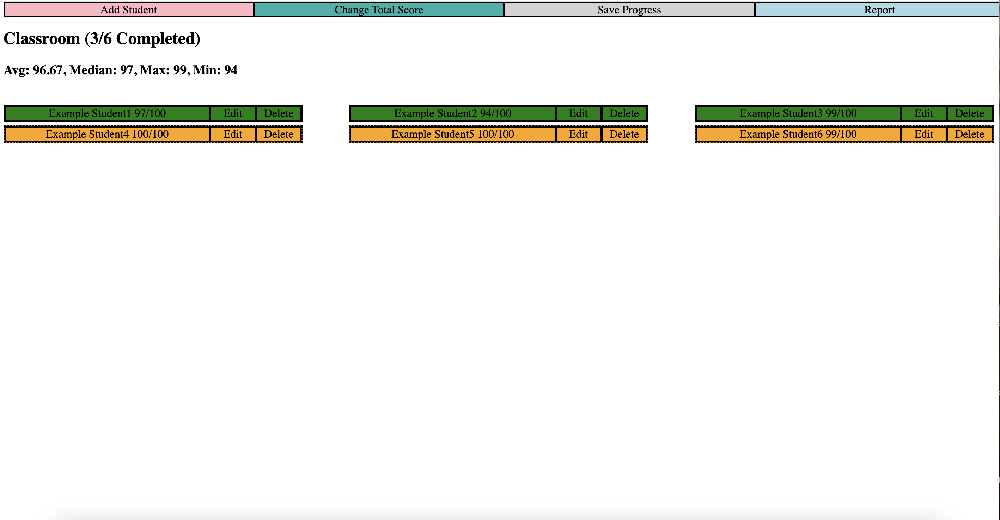
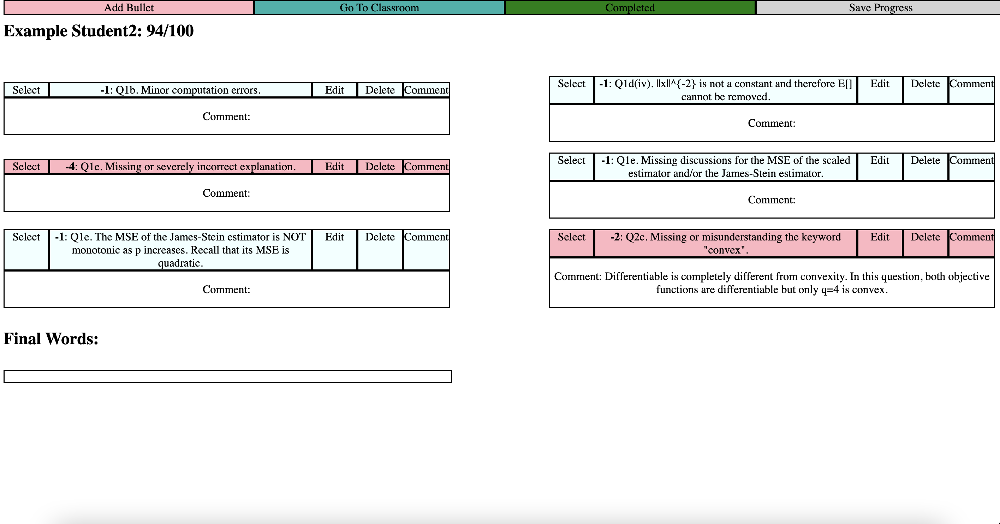
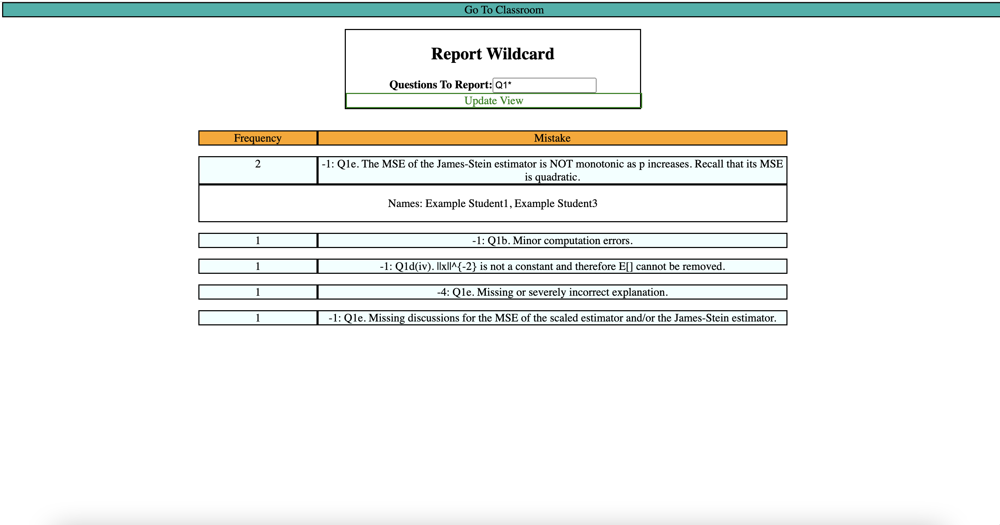

# Grading Assistant
## Background
This repo contains the script that launches a grading assistant locally in the browser. The grading assistant can be applied to homework and exams in all types of submissions. By leveraging the grading assistant, graders can efficiently grade a course with dozens or even hundreds of students, while ensuring that the rubric is easily adjustable and consistent.

Compared to grading on a traditional platform, such as `Canvas`, the grading assistant provided in this repo has distinguished advantages:
* Before Grading
  * Nothing needs to be set stone. Graders are free to set full score, rubrics, and students to grade prematurely. Everything can be easily updated afterwards.
  * Automatically loads and create profiles for the list of students in class. Graders never need to manually enter student names.
* While Grading
  * Keeps all students in sync whenever the rubric or full score are updated.
  * Alerts graders about potential duplication of rubric items before creating a new one.
  * Graders can add individualized comments for each individualized rubric items, clarifying the grading logic on a case by case basis.
  * Easy to save intermediate results to arbitrary local directories and easy to load afterwards.
  * No need to have access to the internet.
  * Clearly marks whether each student's grading is complete as well as the grading progress.
* After Grading
  * Keeps track of common statistics of scores: average, median, max, and min.
  * Automatically generate human-readable and detailed descriptions on why points are deducted or awarded for every single student. Graders can directly copy the descriptions and paste to corresponding student portals.
  * Tracks the names and the number of students associated with each rubric items. Graders can use wildcard to filter a subset of rubric items for questions of interests.
  * Graders can detect potential cheating cohorts by looking at students who share multiple rubric items.

## App Overview
To begin with, the classroom page shows the layout of all students in the class. Students with completed gradings are marked with green, while the remaining ones are marked with orange. The statistics of students grades are computed based on the <strong>completed</strong> ones.

Clicking on the student names will take us to the page for each specific students. If the student's submission matches to any existing rubric items, graders simply need to click `Select`, and the student's grade will be automatically updated accordingly. Graders can also add new rubric items using `Add Bullet`, and `Edit` or `Delete` the items. The rubric will then be reflected for all students. <strong>However, graders should be careful with the `Delete` button, as the rubric item will be deleted across all students once it is clicked, and there is no way to revert.</strong> Graders can add personalized comments to each rubric item using `Comment`. Once the grading has been completed, make sure to mark it as `Completed`. The status of a student can be easily switched between `Completed` and `Incomplete` by clicking the button on the toolbar at the top of the page.

Finally, graders can navigate to the `Report` page to figure out common mistakes from students. For each rubric item, the report demonstrates the number of students who make a certain mistake as well as the names for corresponding students. The rubric items will be sorted from the highest frequency to the lowest frequency.

Graders can also use the `Report Wildcard` to sort out the rubric items associated with a subset of questions. `<text>*` will look for rubric items whose corresponding question matches exactly to `<text>` at the beginning, and can have arbitrary or no characters matched to `*`. For example:
* The `*` will return all rubric items.
* The `Q1` will return rubric items whose question <strong>matches exactly to</strong> `Q1`, with no trailing characters afterwards.
* The `Q1*` will return rubric items whose questions <strong>starts with</strong> `Q1`, possible valid responses include but not limited to `Q1`, `Q1(a)`, `Q1-b`, `Q1(a)-(c)`, etc.

## Tips
* In case of unexpected disruptions from the device, please save your progress frequently. The `Save Progress` button can be found in the toolbar of both `Classroom` and `Student` pages.
* Even though the grading assistant is trying best to provide graders the flexibility to update rubrics, it is still advisable for graders to have a proper design of rubric items at the initial attempt, in order to save efforts. Some suggestions to keep in mind:
  * Try to create the rubric items to cover the aspects as wide as possible. You can always delete or set the point deduction to `0` at a later point, which can automatically applied to all students. Yet, adding a new rubric item on the halfway will require the grader to go back to the graded submissions to check if it has been overlooked previously.
  * The optimal way to phrase each rubric item is <strong>strategic ambiguity with strategic clarity</strong>, which can cover a wide range of students while still pointing students to clear directions. Remember you can always add personalized comments attached to each rubric item for each student to clarify your grading logic.
